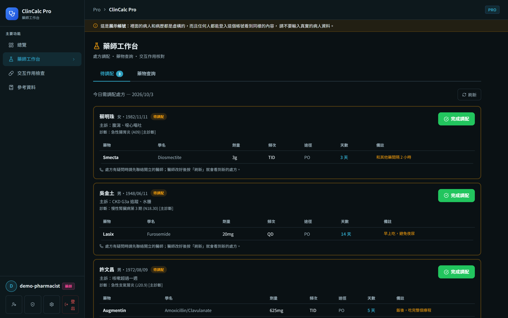
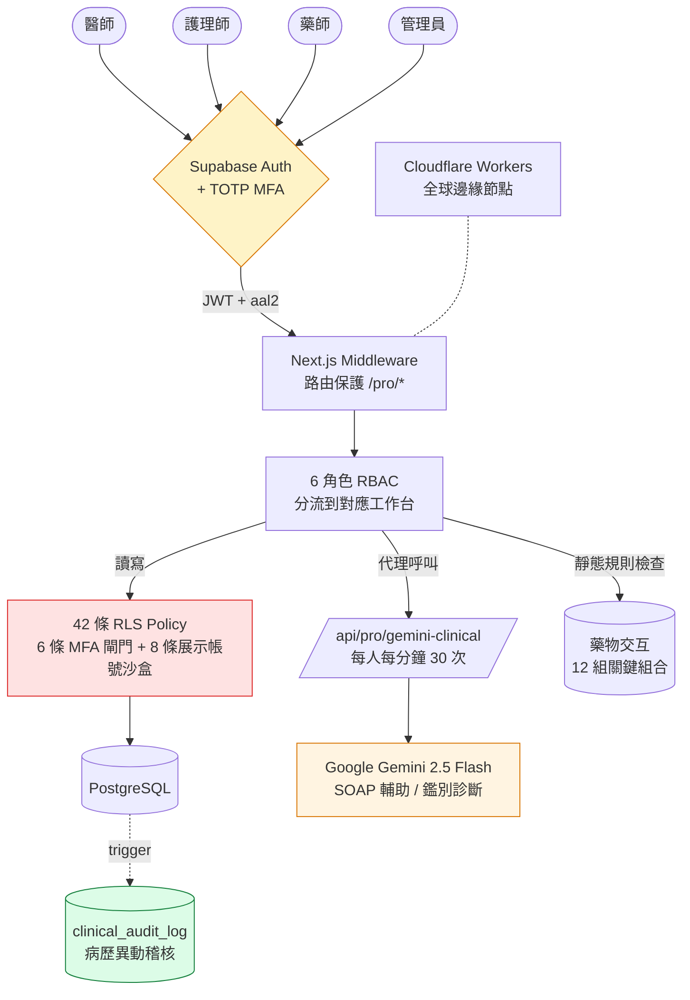

# ExClinCalc Pro — AI 驅動醫師臨床決策支援系統

> 銘傳大學生物醫學工程學系專題研究 · **Clin- 醫療生態系**之**醫事端**
> 同生態系作品：[ClinCalc](https://github.com/yu8812/ClinCalc)（民眾端）· [clinconvert](https://github.com/88jiayu/clinconvert)（FHIR 互通研究）


[](https://github.com/yu8812/exclincalc/actions/workflows/ci.yml)

🔒 **威脅模型**（STRIDE，30 個威脅，每一列都寫實際做到哪裡、還缺什麼）→ [`docs/THREAT_MODEL.md`](docs/THREAT_MODEL.md)


🌐 **線上體驗：[exclincalc.yuyulsc881209.workers.dev](https://exclincalc.yuyulsc881209.workers.dev)**（測試帳號見下方「Demo 帳號」段落）

ExClinCalc Pro 是針對基層診所工作流程設計的醫師臨床決策支援平台（CDSS）。系統將完整診所流程拆解為 **掛號 → 護理分診 → 醫師診療（SOAP 七步驟）→ 藥物交互檢查 → 藥師調配** 五個環節；醫師端的 SOAP 病歷依 20 種主訴模板自動展開引導問題，處方欄位整合 12 組關鍵藥物交互的即時警示。系統部署在 Cloudflare Workers 全球邊緣節點，月成本壓在 5 美元以內。

## 為什麼做這個專案

台灣全民健保覆蓋率達 99.9%、全國醫療院所逾 23,000 家，但**基層診所的資訊化程度落差極大** — 部分診所仍依賴紙本病歷、自製 Excel、或孤島式商用軟體。在大型醫院端有完整 HIS / EMR 系統，但中小型診所要嘛買不起、要嘛流程不合用。

同時，AI 在醫療決策支援的應用快速進展（如 Med-PaLM 2、Gemini 多模態），但兩個現實限制使其難以真正落地：

1. **法規與責任** — AI 不能取代醫師決策，最多輔助
2. **資料安全** — 醫療資料若集中在第三方雲端不可控，是合規地雷

ExClinCalc 的設計回應這兩個限制：

- **完整工作流程閉環**：不是只做病歷編輯器，是**掛號 → 分診 → SOAP → 處方 → 調配**五個環節都做，反映真實診所運作
- **資料庫層權限控制**：透過 PostgreSQL Row Level Security（**42 條 policy**，其中 6 條 RESTRICTIVE 閘門要求 MFA、8 條把展示帳號關在展示資料裡），即使前端程式有漏洞，跨使用者資料也不會被讀走
- **TOTP 強制 MFA**：所有醫事人員帳號都要綁兩步驟驗證，沒過 MFA 的登入讀不到病人資料
- **病歷異動留紀錄**：病歷和 SOAP 筆記每次新增、修改、刪除，都由資料庫 trigger 記下改前改後的內容和操作者
- **AI 為提示而非決策**：Gemini 用於 SOAP A/P 段建議、藥物交互敘述生成；SOAP 筆記裡的 AI 建議要醫師自己按「加到評估欄」才會寫進去

目標：**作為基層診所資訊化的參考實作**，並在合理的安全與合規前提下，展示 AI 整合進醫療工作流程的具體做法。

## 功能展示

| 醫師 SOAP 七步驟診療流程 | 藥物交互作用即時警示 |
|:---:|:---:|
|  |  |
| 20 種主訴模板自動展開引導問題，ICD-10 自動建議 | 12 組關鍵藥物交互即時警示，紅色高優先警告 |

| 護理師分診工作台 | 藥師調配工作台 |
|:---:|:---:|
|  |  |
| 7 項生命徵象結構化輸入，醫師端可一鍵帶入 | 調配前確認病人與藥品、由資料庫記錄調配者與時間 |


*管理者分析儀表板：平台使用統計、用戶活躍度、處方分布等指標*

## Demo 帳號

> ⚠️ 以下帳號僅供體驗系統流程，內含**合成假資料**，**請勿輸入真實病患資料**。

| 角色 | Email | 密碼 |
|---|---|---|
| 醫師 (doctor) | `demo-doctor@example.com` | `demo1234` |
| 護理師 (nurse) | `demo-nurse@example.com` | `demo1234` |
| 藥師 (pharmacist) | `demo-pharmacist@example.com` | `demo1234` |
| 管理員 (admin) | `demo-admin@example.com` | `demo1234` |

> **Demo 帳號免 MFA**：這些帳號標記 `is_demo=true`，在資料庫（RLS）和網站都不用 TOTP，可以直接登入體驗。因為帳密是公開的，它們被限制在展示資料裡：資料庫對每張含病人資料的表都加了 RESTRICTIVE policy，展示帳號只碰得到展示帳號擁有的資料；展示用 admin 只能瀏覽，不能改帳號、藥物資料庫或資源庫，也讀不到稽核紀錄。**真實帳號仍全面強制 MFA**，首次登入會被導到 `/pro/security` 用 Google Authenticator 掃 QR 綁定。展示資料每天台灣時間 00:01 自動重置（訪客改過、刪過的都會還原，日期也會換成當天）。

## 核心模組（六種角色）

| 角色 | 主要工作台 | 核心功能 |
|---|---|---|
| 醫師 (doctor) | `/pro/dashboard`、`/pro/encounter`、`/pro/patients` | 儀表板、SOAP 七步驟診療、病患管理、ICD-10 自動建議 |
| 護理師 (nurse) | `/pro/nursing` | 分診工作台、輸入 7 項生命徵象 → 醫師端可一鍵帶入 |
| 藥師 (pharmacist) | `/pro/pharmacy` | 處方調配（不能改醫師開的處方，有疑問要回頭問醫師）、藥物交互檢查 |
| 行政 (admin_staff) | `/pro/appointments`、`/pro/patients` | 掛號管理、查看病人和病歷（不能寫病歷）|
| 管理員 (admin) | `/pro/admin/*`、`/pro/analytics` | 帳號管理、藥物資料庫與參考值維護、健康記錄總覽、使用統計 |
| 超級管理員 (super_admin) | 同 admin | 同 admin，另外可以處理其他管理員的帳號、指派管理員角色 |

## 技術棧

- **Next.js 16** App Router + React 19 + TypeScript
- **Tailwind CSS v4**（Pro 深藍色系 design tokens）
- **Supabase**（PostgreSQL + Auth + RLS + TOTP MFA）
- **Google Gemini 2.5 Flash**（鑑別診斷、藥物交互敘述、SOAP A/P 段輔助）
- **Cloudflare Workers**（OpenNext for Cloudflare 轉接器，全球邊緣節點）
- **GitHub Actions**（每次 push 跑型別檢查、單元測試和 109 條 RLS 整合測試；定期喚醒 Supabase）

## 系統架構



**設計重點**：
- 🔴 **資料庫層權限**（RLS）── 前端或 API 的檢查被繞過，資料庫照樣只給該角色允許的資料（前提是攻擊者拿不到伺服器上的 service role key，見 THREAT_MODEL E4）
- 🟡 **TOTP 強制 MFA** ── 所有 pro 帳號都要綁；病人資料要求這次登入有過 MFA
- 🟢 **稽核** ── 病歷和 SOAP 筆記的每次異動由 trigger 寫進 `clinical_audit_log`；管理員的帳號操作寫進 `audit_logs`。兩者都沒有自動清除
- 🟠 **AI 為輔** ── Gemini 只給建議，要醫師自己決定要不要採用

## 安全性設計

### 1. PostgreSQL Row Level Security（核心防線）

兩個子系統共用同一份 PostgreSQL，**42 條 RLS policy**：權限檢查不只寫在後端程式裡，而是由 PostgreSQL 在執行查詢時比對 JWT 和 policy。瀏覽器會直接打 Supabase 的 API，所以這一層才是真正的邊界。

安全狀態由 15 個 forward migration 逐步建構（`supabase/migrations/`，見該資料夾 README）：角色權限與欄位級 REVOKE（01）、同意書完整性（02、06）、病人資料要求 MFA（03、04）、**6 張純醫事表的 RESTRICTIVE MFA 閘門**（05，和 permissive policy 做 AND，繞不過）、角色能力矩陣（07）、展示帳號免 MFA（08）、policy 清理（09）、2026-10 的稽核修補（10–15：profiles 外洩、與正式庫對齊、限流、管理權收緊和展示帳號沙盒、病歷異動稽核、調配蓋章）。每支都有 RLS 整合測試（目前 109 條）。另外 16 讓展示資料每天自動重置，17 讓藥師工作台只拿得到調配需要的病人資料（姓名、性別、生日）。基礎 schema 見 [`supabase/complete_setup.sql`](supabase/complete_setup.sql)。

**設計亮點**：PERMISSIVE + RESTRICTIVE 組合把 AAL2 以 AND 硬性套上；SECURITY DEFINER helper + `set search_path` 消除 policy 自我參照的無限遞迴；欄位級授權讓 `is_pro` / `pro_role` / `is_demo` 無法被使用者自行修改。

### 2. TOTP 雙重驗證（兩階段強制）

ExClinCalc 對所有 `pro` 角色強制啟用 TOTP：

- **首次登入**：[`/auth/login`](src/app/auth/login/page.tsx) 偵測 `nextLevel === "aal1"` 且 user 為 pro → 引導至 [`/pro/security?firstLogin=true`](src/app/(pro)/pro/security/page.tsx) 完成 enroll
- **每次後續登入**：[`/auth/login`](src/app/auth/login/page.tsx) 偵測 `nextLevel === "aal2"` 且當前 session `currentLevel !== "aal2"` → 跳 [`/auth/mfa-verify`](src/app/auth/mfa-verify/page.tsx) 輸入 6 位數動態碼
- **路由保護**：[`src/middleware.ts`](src/middleware.ts) 對所有 `/pro/*` 路由要求 aal2，未通過自動 redirect mfa-verify
- **輸錯 5 次暫停 15 分鐘**：計數存在瀏覽器的 `sessionStorage`，只能擋手誤、拖慢速度，不是伺服器端的帳號鎖定（Supabase Auth 另有自己的頻率限制）

實作 API：`supabase.auth.mfa.enroll / challenge / verify / unenroll / listFactors / getAuthenticatorAssuranceLevel`

### 3. 稽核

- **`clinical_audit_log`**（migration 14）：`clinical_records`、`soap_notes` 每次新增、修改、刪除，由資料庫 trigger 記下改前改後的整筆內容、操作者、當下角色、IP、瀏覽器。稽核寫不進去時，原本的修改也會一起失敗。沒有任何寫入 policy，只能從 trigger 進來；只有通過 MFA 的管理員讀得到。
- **`audit_logs`**：管理員對帳號的操作（改角色、重設密碼、重設 MFA、刪除帳號），只由伺服器寫入。
- **調配紀錄**（migration 15）：藥師按「完成調配」時，調配者和時間由資料庫決定，之後不能再改。
- 沒有保留期限也沒有自動清除；「誰讀了病歷」目前沒有記錄（見 THREAT_MODEL R3）。

### 4. API 金鑰管理

| 金鑰 | 存放位置 | 是否暴露至前端 |
|---|---|---|
| `GEMINI_API_KEY` | Cloudflare Workers runtime secret | ❌ |
| `SUPABASE_SERVICE_ROLE_KEY` | Cloudflare Workers runtime secret | ❌ |
| `NEXT_PUBLIC_SUPABASE_ANON_KEY` | Build-time inline | ✅（受 RLS 保護，安全） |

所有 Gemini 呼叫透過 [`/api/pro/gemini-clinical`](src/app/api/pro/gemini-clinical/) 後端代理，前端只看到結果，看不到金鑰。

## 本地開發

### 前置需求
- Node.js 22+
- 一個 Supabase 專案
- 一個 Google AI Studio API Key

### 步驟

```bash
# 1. 安裝依賴
npm install

# 2. 建立 .env.local（範本見下方）

# 3. 初始化資料庫：在 Supabase SQL Editor 依序執行
#    supabase/complete_setup.sql       (基礎 schema：10 張表 + 基礎 RLS；跑完下方 migrations 後和正式庫一樣是 15 表 / 42 policy，
#                                       另外會多一張正式庫沒有建的 reference_pdf_links)
#    supabase/clinic_flow.sql          (擴充處方欄位 + 補 RLS)
#    supabase/create_patient_consents.sql
#    supabase/create_reference_pdf_links.sql
#    supabase/seed_medications.sql     (選用：30 種台灣常用藥)
#    supabase/seed_resources.sql       (選用：醫療參考資源)
#
# 3b. ★ migrations（必跑，依序 01→17）— 讓 fresh install 與正式環境得到相同的狀態：
#    01_role_authority              角色權限授權 + 欄位級 REVOKE + 防自我提權 trigger
#    02_consent_integrity           同意書欄位/policy/atomic token
#    03_phi_aal2_consent_hardening  PHI 讀取要求 AAL2 + 拒匿名 + 反遞迴 helper
#    04_global_aal2_phi             全病歷表 AAL2 + is_pro（is_active_pro_aal2 / is_active_role_aal2）
#    05_restrictive_aal2_gate       6 張純醫事表加 RESTRICTIVE AAL2 閘門（與 permissive 做 AND）
#    06_consent_deletion_lifecycle  同意書刪除生命週期 trigger + 單一有效授權唯一索引
#    07_role_capability_matrix      角色能力矩陣（藥師配藥、護理師寫/醫師讀 triage）
#    08_demo_aal2_exemption         demo 帳號豁免 AAL2（僅合成資料）
#    09_policy_cleanup              刪掉重複和沒在用的 policy
#    10_profiles_exposure_fix       修掉任何人都能讀 profiles 的舊 policy
#    11_schema_drift_sync           profiles policy 與正式庫對齊
#    12_rate_limits                 持久化限流表 + check_rate_limit（只限伺服器呼叫）
#    13_admin_and_demo_hardening    管理權要求 MFA 且排除展示帳號、資源庫寫入修補、展示帳號沙盒
#    14_clinical_audit_log          病歷與 SOAP 筆記異動稽核
#    15_dispense_attribution        調配者與調配時間由資料庫決定
#    16_demo_data_reset             展示資料每天自動重置（pg_cron，台灣時間 00:01）
#    17_pharmacy_queue              藥師工作台用 pharmacy_queue() 取得病人姓名（不開放整張病人表）
#          ⚠️ 前提：03–05 對 PHI 強制 AAL2，套用「前」所有非 demo 的 pro 帳號必須先 enroll+challenge MFA
#             取得 aal2，否則會失去病歷存取。順序：先綁 MFA → 再套 migration。
#    ⚠️ pro_schema.sql 與 scripts/run-schema.mjs 已 DEPRECATED（勿執行；會撤銷 migration 04）。
#       正式 schema 來源 = complete_setup.sql + 上述 migrations。詳見 supabase/migrations/README.md。
#
# 3c. 選用：示範門診資料（要在 migrations 之後跑）
#    supabase/seed_50_patients.sql     (50 位虛構病人與今天的掛號、分診；5 位有 SOAP、病歷和處方)

# 4. 開通管理員角色（將自己的帳號設為 admin）：
#    UPDATE profiles SET is_pro=true, pro_role='admin' WHERE id='<你的 auth uid>';

# 5. 啟動 dev server（Windows 用 webpack 避免 Turbopack WASM 問題）
npm run dev                          # macOS / Linux
npx next dev --webpack -p 3001       # Windows
# → http://localhost:3001
```

### `.env.local` 範本

```env
# Supabase
NEXT_PUBLIC_SUPABASE_URL=https://YOUR_PROJECT.supabase.co
NEXT_PUBLIC_SUPABASE_ANON_KEY=YOUR_ANON_KEY
SUPABASE_SERVICE_ROLE_KEY=YOUR_SERVICE_ROLE_KEY

# Google Gemini
GEMINI_API_KEY=YOUR_GEMINI_KEY
```

> ⚠️ `.env.local` 已列入 `.gitignore`。`SUPABASE_SERVICE_ROLE_KEY` 繞過 RLS，**僅可在伺服器端使用**。
>
> ⚠️ `.env.local` 只放上面四個。OpenNext 建置時會把 `.env.local` 的變數打包進 worker，所以資料庫連線字串（維護腳本 `scripts/*.mjs` 才需要）另外放在 `.env.database` 的 `DATABASE_URL`，同樣不進版控。

### Seed SQL 內的 Email 替換

跑 seed 前須將 `seed_50_patients.sql` 內的 `YOUR_DOCTOR_EMAIL@example.com` 替換成你 Supabase 上實際的醫師帳號 email。

## 部署到 Cloudflare Workers

目前採**本機 wrangler 直推**（非 git-connected CI）：

```bash
npm run cf:build          # OpenNext 轉譯 → .open-next/worker.js
npx wrangler login        # 首次；或設 CLOUDFLARE_API_TOKEN
npx wrangler deploy       # 部署到 Cloudflare Workers
```

> ⚠️ `cf:build` 內部的 `next build` 必須走 **webpack**（`package.json` 已固定 `--webpack`）。opennextjs-cloudflare 無法執行 Turbopack 的輸出，否則 runtime 會 `ChunkLoadError` / `handler is not a function`。

### Runtime 密鑰（`wrangler secret put`）
- `SUPABASE_SERVICE_ROLE_KEY`、`GEMINI_API_KEY`（皆繞過前端，僅伺服器端）
- `APP_ORIGIN`（非密鑰，寫在 `wrangler.toml` 的 `[vars]`）
- `NEXT_PUBLIC_*` 於 build 時烤入前端 bundle（受 RLS 保護）

DB migration 以 `pg` client 連 Supabase **Session pooler**、逐檔包 transaction 套用（見 `supabase/migrations/README.md`）。

> GitHub Actions 的 `deploy.yml` 需要 `CLOUDFLARE_API_TOKEN` secret，目前沒有設定，所以改成只能手動觸發；實際部署用上面的本機 wrangler。

## 主要 API 路由

| 路由 | 方法 | 功能 |
|---|---|---|
| `/api/pro/gemini-clinical` | POST | 醫師助手模式 Gemini 呼叫（每人每分鐘 30 次；展示帳號共用每分鐘 10 次、每天 100 次）|
| `/api/pro/drug-interactions` | POST | 多藥物交互作用分析（靜態表 + medications.interactions[]） |
| `/api/pro/analytics` | GET / POST | 平台統計（管理員；展示 admin 只看到展示資料）／ AI 摘要 |
| `/api/pro/admin/*` | POST/PUT/DELETE | 資料表 CRUD（白名單限 medications/medical_references） |
| `/api/pro/consent/invite` | POST | 產生 patient_consents 一次性權杖 |
| `/api/ping` | GET | Supabase 健康檢查（供 keep-alive workflow） |

## 自動化 Workflows

| Workflow | 觸發 | 功能 |
|---|---|---|
| `ci.yml` | push、PR | 型別檢查 + 單元測試 + RLS 整合測試（每次在一次性的本機 Supabase 上跑）|
| `keep-alive.yml` | 每天 16:00（台灣時間）| Ping Worker `/api/ping`，避免 Supabase 免費專案閒置被暫停 |
| `deploy.yml` | 手動 | 部署到 Cloudflare Workers（需要 `CLOUDFLARE_API_TOKEN`）|
| `sync-references.yml` | 手動 | 同步參考值到 `medical_references`（需要 service role secret）|
| `check-versions.yml` | 手動 | 檢查 KDIGO／ADA／ACC-AHA 等指引是否有新版（需要 service role secret 和 `reference_pdf_links` 表）|

## 程式碼導覽（給審查者）

如果你是研究所教授、招生委員或對特定模組有興趣的工程師，以下是快速導覽：

| 想看什麼 | 看哪個檔 |
|---|---|
| RLS 權限矩陣（15 表 / 42 policy，附錄由腳本從正式庫產生）| [`docs/permission-matrix.md`](docs/permission-matrix.md)；基礎 schema 見 [`supabase/complete_setup.sql`](supabase/complete_setup.sql) |
| TOTP 兩階段強制流程 | [`src/middleware.ts`](src/middleware.ts) + [`src/app/auth/login/page.tsx`](src/app/auth/login/page.tsx) + [`src/app/auth/mfa-verify/page.tsx`](src/app/auth/mfa-verify/page.tsx) |
| 醫師 SOAP 七步驟 + 20 種主訴模板 | [`src/app/(pro)/pro/encounter/`](src/app/(pro)/pro/encounter/) |
| 藥物交互即時警示（12 組） | [`src/app/api/pro/drug-interactions/`](src/app/api/pro/drug-interactions/) |
| Gemini 後端代理（依使用者限流） | [`src/app/api/pro/gemini-clinical/`](src/app/api/pro/gemini-clinical/) |
| 6 角色 RBAC 路由保護 | [`src/middleware.ts`](src/middleware.ts) |
| 病歷異動稽核 trigger | [`supabase/migrations/20261003_14_clinical_audit_log.sql`](supabase/migrations/20261003_14_clinical_audit_log.sql) |
| RLS 整合測試（109 條）| [`supabase/tests/rls_matrix.mjs`](supabase/tests/rls_matrix.mjs) |
| 正式庫和 repo 的 schema 漂移比對 | [`scripts/schema-drift.mjs`](scripts/schema-drift.mjs)（`npm run check:drift`）|
| 用不同身分逐表實測讀、改、刪 | [`scripts/exposure-scan.mjs`](scripts/exposure-scan.mjs)（`npm run check:exposure`）|
| CI/CD（部署 + 月度同步 + keep-alive + 版本檢查） | [`.github/workflows/`](.github/workflows/) |

## 從實作中發現的研究問題

完成 ExClinCalc 後，我整理出三個值得深入研究的方向，作為碩士階段研究計畫的延伸：

1. **多租戶醫療系統的 RLS 設計方法論**
   我用 42 條 RLS policy 把權限放在資料庫層，但這個設計**沒有系統化的方法**。每次加新表都要自己想「policy 怎麼寫」，很容易遺漏或不一致。2026 年 10 月我寫腳本比對正式庫和 repo，就發現有 policy 只存在正式庫、沒有進版控，還有一條讓任何登入者都能改寫資源庫的 policy —— 這些都通過了原本的測試。**怎麼從業務需求推導出 policy 草稿？怎麼驗證 policy 的完整性，並偵測正式環境和版控之間的漂移？** 是我想深入的問題。

2. **LLM 安全嵌入 SOAP 工作流程的分級架構**
   ExClinCalc 目前讓 Gemini 輔助 SOAP 的 A（Assessment）、P（Plan）兩段，但**沒有量化評估幻覺率與覆蓋率的取捨**。我的「先規則後 LLM」策略在 KDIGO 分期、藥物交互這類有明確規則的場景運作良好，但在「鑑別診斷」這類本質模糊的場域有限制。**怎麼設計分級的 LLM 介入比例？怎麼量化評估？** 是值得研究的問題。

3. **臨床決策支援工具的真實場域評估方法**
   ExClinCalc 在功能上完整，但**沒有在真實診所運作過**。學界很多 CDSS 研究停留在「功能完整度評估」，缺少「實際導入評估」。**怎麼設計嚴謹的 CDSS 真實場域評估方法？包含使用者接受度、工作流程影響、警示疲勞量測？** 這是 implementation science 的研究方向。

延伸閱讀：[「為什麼選 RLS 而不是應用層權限」案例研究](https://github.com/yu8812/exclincalc/blob/main/docs/case-study-rls.md)

## 學術引用

本專題撰寫於 2026 年 2 月，相關論文：

> 江家寓，《醫療輔助系統的設計與實作——以慢性腎臟病評估為核心案例之雙層健康資訊平台》，銘傳大學生物醫學工程學系專題研究，2026。

## 我是誰

**江家寓 / Chia-Yu Chiang**
銘傳大學 生物醫學工程學系 · 2026 應屆畢業
跨領域：電腦通訊工程 → 生物醫學工程
研究興趣：醫療資訊系統 / 臨床決策支援 / LLM 安全嵌入

🌐 **個人網站**：[jiayuselfweb.pages.dev](https://jiayuselfweb.pages.dev)（含完整 case study、研究探討、Reading List）
📧 yuyulsc881209@icloud.com
💻 GitHub：[github.com/yu8812](https://github.com/yu8812)

## Clin- 生態系

本作品是 **Clin- 系列**之一 ── 4 件作品共用同一套技術主軸
（Cloudflare Workers + Supabase + PostgreSQL RLS + TypeScript strict）。
不是各做各的、是**一個生態系**、環環相扣：

| 作品 | 角色 | 對應 |
|---|---|---|
| [ClinCalc](https://github.com/yu8812/ClinCalc) | 民眾端 · 健康自查 + AI 解讀 | 入口：把醫療資料變得**看得懂** |
| **ExClinCalc**（本作品） | 醫事端 · 診所 CDSS | 流程：醫師 / 護理師 / 藥師完整工作流 |
| [clinconvert](https://github.com/88jiayu/clinconvert) | 互通研究 · FHIR R4 轉換 POC | 標準化：跨機構資料**可互通** |
| [Kaizei](https://jiayuselfweb.pages.dev/projects/kaizei) | 跨領域 · Personal Finance OS | 證明同套工程方法**跨領域複用** |

設計理念：**隱私先行（local 端處理）· 規則優於 LLM · 安全在資料庫層**。
詳見[個人網站](https://jiayuselfweb.pages.dev)。

歡迎研究合作、面談請益、或對任何技術細節提問。

## 開發方式

開發時使用 AI 輔助（Claude、GPT），架構決策、測試與上線驗證由我負責。

## 授權

MIT License — 學術與非商業用途自由使用。商業使用請先聯絡作者。

本系統提供之臨床建議僅供醫事人員參考，**不構成任何醫療診斷或處方**。所有臨床決策應由合格醫師依專業判斷做成，系統建議僅作輔助。
